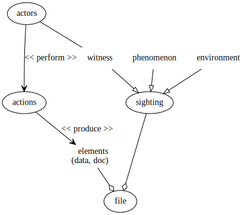

# the UAP initiative DRM project

The _UAP initiative DRM project_ aims to define a data recording model -- DRM --
which describes components and links in UAP's sightings files.

It is developped in a public GitHub repository and is opened to contributors.
This website will publish the latest release of the project.

More on the [UAP-initiative website](https://www.uap-initiative.org).

## UAP's sightings modelisation

We describe a sighting in two ways : as an event and as a collection of facts on
record.

### Event reported

As an event, an UAP's sighting can be defined as an interraction between a
_witness_, a _phenomenon_ and the _environment_. Of course many witnesses may
report a sighting at the same time. And many sightings made by different groups
of witnesses can possibly refer to a same phenomenon to constituate a _case_.

In this model witnesses are considered as _actors_ of the case. That is,
_people_ who play the _role_ of witnesses.

### Facts on record

A sighting also is a collection of _elements_ : photos, videos, transcriptions,
schemas, measurements, etc. Each element may be 

* a document (photo, video, schemas, transcription, etc.) or a data
  (measurement) ;
* stored locally (witness, investigator) or shared through a network ;
* the original one or an altered copy ;
* described with metadata (type, description, title, author, etc.).

## Data Recording Model
